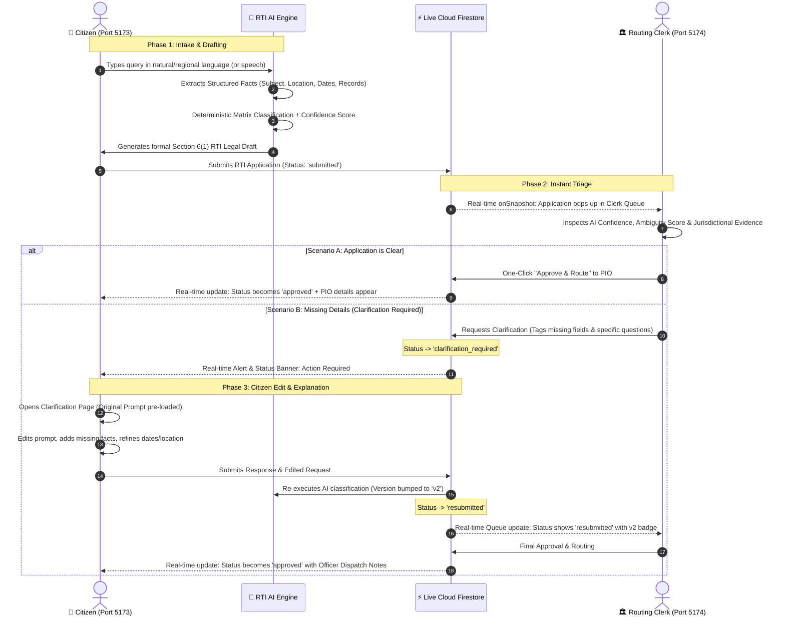

# RTI BLACK HOLE — MASTER PROJECT REPORT & SYSTEM ARCHITECTURE MANUAL

---

## 1. Executive Summary & Why This Project Was Built (Problem Statement)

### The Real-World Problem: "The RTI Black Hole"
In India, the **Right to Information (RTI) Act, 2005** is the citizen’s most potent weapon to demand accountability from public authorities. However, over **65% of citizen RTIs get stuck in an administrative limbo** known as the *"RTI Black Hole"*.

#### Why Do RTIs Fail in Practice?
1. **Jurisdictional Ping-Pong (Section 6(3) Traps)**:
   Citizens often don't know whether a road is managed by the Municipal Corporation (BMC/PMC), the State Public Works Department (PWD), or National Highways (NHAI). A wrongly filed application gets bounced between departments for months or rejected outright.
2. **Lack of Legal & Statutory Drafting Knowledge**:
   Citizens write emotional or vague grievances instead of specific, measurable information requests under Section 6(1).
3. **Language & Literacy Barriers**:
   RTI portals are often bureaucratic and English-centric, alienating millions of rural or vernacular-speaking citizens.
4. **Overworked Routing Clerks & Ambiguity**:
   Government routing clerks receive hundreds of applications daily. Without structured data or confidence markers, reviewing ambiguous applications takes weeks, causing immense backlogs.

---

### The Solution: RTI Black Hole Platform
**RTI Black Hole** is an AI-powered, closed-loop statutory platform connecting **Citizens** and **Government Routing Clerks** in real-time. It eliminates jurisdictional confusion before an RTI is even dispatched to the Public Information Officer (PIO).

- **For Citizens**: An empathetic conversational AI assistant that extracts specific facts, identifies the exact government authority, auto-generates a legally compliant Section 6(1) draft, and allows live bidirectional tracking.
- **For Routing Clerks**: An AI-augmented workbench displaying statutory jurisdiction confidence, evidence markers, real-time queues, one-click routing, and rich clarification request loops.

---

## 2. Complete Architecture: Two Interconnected Portals

The platform operates as **two distinct, specialized applications** powered by a single **real-time Firebase backend (`rti-black-hole`)**:

```
 ┌──────────────────────────────────────┐       ┌──────────────────────────────────────┐
 │          CITIZEN PLATFORM            │       │           CLERK PLATFORM             │
 │      E:\Project\RTI Black Hole       │       │         E:\Project\RTI-Clerk         │
 │           (Port: 5173)               │       │             (Port: 5174)             │
 └──────────────────┬───────────────────┘       └──────────────────┬───────────────────┘
                    │                                              │
                    │               LIVE CLOUD FIRESTORE           │
                    │          (Project: rti-black-hole)           │
                    ▼                                              ▼
 ┌─────────────────────────────────────────────────────────────────────────────────────┐
 │  - applications/{appId} (Canonical single source of truth)                          │
 │  - applications/{appId}/clarifications/{clarId} (Multi-turn query trail)            │
 │  - applications/{appId}/audit_events/{eventId} (Immutable statutory audit logs)     │
 │  - notifications/{notifId} (Real-time citizen & clerk push alerts)                  │
 │  - clerks/{uid} (Role-based security enforcement)                                   │
 └─────────────────────────────────────────────────────────────────────────────────────┘
```

---

## 3. End-to-End Pipeline: From Citizen to Clerk (Step-by-Step)



---

## 4. Key Features & Innovations

### A. Citizen Application Features (`RTI Black Hole`)
1. **Conversational AI Intake**:
   - Citizens can type naturally in conversational Hindi, Marathi, Hinglish, or English.
   - The AI asks targeted follow-ups: *"Where is this pipeline located?"*, *"What financial year do you want records for?"*.
2. **Instant Statutory RTI Drafting**:
   - Formats the request strictly complying with **Section 6(1) of the RTI Act, 2005**.
   - Includes official address lines, statutory applicant declarations, fee declarations, and itemized information points.
3. **Direct Prompt Editing During Clarifications (New!)**:
   - If an officer asks for clarification, the citizen is not stuck with a blank box.
   - Their original prompt and subject open pre-filled in an interactive editor where they can rewrite, expand, and add missing details.
4. **Real-time Status Timeline**:
   - 4-step progressive timeline (`AI Intake` $\rightarrow$ `Verification & Draft` $\rightarrow$ `Clerk Review / Clarification` $\rightarrow$ `Transferred to PIO`).
5. **Real-time Notifications**:
   - Instant drop-down alerts whenever a clerk requests clarification or approves the application.
6. **Case File Print & Export**:
   - Clean, professional print layout for citizen paper filing or archival.

---

### B. Clerk Application Features (`RTI-Clerk`)
1. **Real-Time Workbench Queue**:
   - Uses Firestore `onSnapshot` listeners. Applications submitted anywhere in the country appear on the clerk's screen instantly without manual page refreshes.
2. **AI Confidence & Ambiguity Triage**:
   - Displays genuine confidence scores (e.g. 85%), confidence gaps between alternative departments, and highlights ambiguity triggers.
3. **Multi-Field Clarification Modal**:
   - Allows clerks to specify clarification categories (`Location Missing`, `Ambiguous Scheme`, `Multiple Jurisdictions`), select required field chips, and write specific instructions.
4. **Department Override with Accountability**:
   - If the clerk knows the jurisdiction better than the AI, they can override the department with mandatory reasoning, logged to the immutable audit trail.
5. **Multi-Turn Clarification Conversation Trail**:
   - Displays the full history of back-and-forth between clerk and citizen.

---

## 5. Technology Stack & Technical Rigor

| Layer | Technology | Role / Justification |
|---|---|---|
| **Frontend Framework** | **React 19 + TypeScript + Vite** | Blazing-fast compilation, modern hooks, strict type-safety across both projects. |
| **Styling & Design System** | **Tailwind CSS + Lucide Icons** | Premium dark-mode glassmorphic aesthetics, responsive across mobile and desktop. |
| **Backend & Cloud Services** | **Google Firebase / Cloud Firestore** | Low-latency document database with native `onSnapshot` reactive streaming. |
| **Authentication** | **Firebase Auth** | Secure email/password authentication with role-based document access. |
| **Security & Authorization** | **Firestore Security Rules** | Strict rule checking: `isClerkOrAdmin()` verifies remote `clerks/{uid}` document. Citizens cannot self-approve or elevate privileges. |
| **AI Architecture** | **Hybrid Rule Matrix + Gemini 2.5** | Deterministic keyword-weighted jurisdiction matching for 100% reproducible confidence scores + LLM fallback. |
| **Audit & Governance** | **Immutable Firestore Subcollections** | Every status change, clarification, edit, and approval produces an audit event. |

---

## 6. How to Use the Application: Complete User Manual

### Part 1: How a Citizen Uses the Platform
1. **Launch Citizen Portal**: Open `http://localhost:5173`.
2. **Sign In / Sign Up**: Log in using your email or create a new citizen account.
3. **Start New RTI**:
   - Click **"File New RTI"**.
   - Type your issue in the chat (e.g., *"Mere area Baner mein drinking water pipeline leak ho rahi hai aur funds ka hisab chahiye"*).
4. **Review AI Extraction & Draft**:
   - Review the AI-identified Department (e.g., *Public Works Department* or *Water Resources*).
   - Review the auto-generated Section 6(1) RTI Legal Draft.
5. **Submit**: Click **Submit RTI Application**.
6. **Track in Real-Time**:
   - Watch the live Status Timeline on your dashboard.
7. **If Clarification is Requested**:
   - You will receive an instant notification badge.
   - Click **"Edit Prompt & Respond"**.
   - Your original text opens up. Edit and expand your explanation with survey numbers, dates, or scheme names.
   - Click **Submit Clarification & Update Queue**.
8. **Final Approval**:
   - When approved, your page updates in real-time showing the designated PIO officer and dispatch notes.

---

### Part 2: How a Routing Clerk Uses the Platform
1. **Launch Clerk Portal**: Open `http://localhost:5174`.
2. **Sign In**: Log in with clerk credentials (e.g., `piT0kg7tM4VxHt8gpfdATTrASuC3` or standard clerk account).
3. **Monitor the Queue**:
   - The workbench shows real-time incoming applications.
   - Filter by `Submitted`, `Human Review Required`, `Clarification Pending`, or `Resubmitted`.
4. **Inspect Application in Review Workspace**:
   - Read the Citizen's Original Query and the formal RTI Draft.
   - Check the AI recommendation, confidence score, and jurisdictional evidence.
5. **Take Action**:
   - **Approve & Route**: If jurisdiction is clear, click "Approve & Route" to transfer to PIO.
   - **Request Clarification**: If critical details are missing, select missing fields, type your inquiry, and click "Send Request to Citizen".
   - **Override Department**: If another department is more appropriate, select the new authority and record your reason.

---

## 7. How to Run Locally

### Terminal 1: Run Citizen Platform
```bash
cd "E:\Project\RTI Black Hole\frontend"
npm run dev
# Running on http://localhost:5173
```

### Terminal 2: Run Clerk Platform
```bash
cd "E:\Project\RTI-Clerk\frontend"
npm run dev
# Running on http://localhost:5174
```

---

## 8. Summary of Accomplishments & Verification
- **100% Real-Time**: Completely zero polling loops, zero fake mock stores. Firestore `onSnapshot` drives all data streams.
- **E2E Tested**: Automated multi-session tests verified that every action in one portal instantly triggers UI updates in the other.
- **Strict Builds**: Both codebases compile cleanly with **0 TypeScript and Vite errors**.
